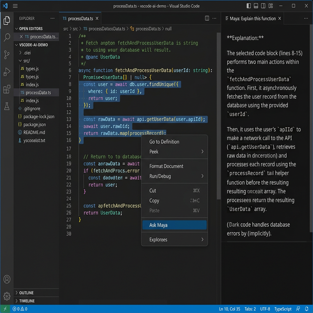

# Axiom — Ask Maya 🧠

**Get instant AI-powered code explanations, bug detection, and optimization tips — right inside VS Code.**

Maya is the AI assistant behind [Axiom](https://axiom-learn.com), the learning platform trusted by developers to master modern web technologies. Now Maya lives inside your editor.

---

---

## ✨ Features

### 🤖 Autonomous Coding Agent (New in v0.7.0)
Maya is now a fully autonomous agent capable of:
- **Project Brain**: Search for code patterns across your entire project instantly.
- **Self-Awareness**: Maya tracks her own progress via a `.maya/roadmap.md` file.
- **Multi-File Atomic Edits**: Plan and execute complex changes across multiple files in a single turn.
- **Environment Intelligence**: Maya understands your OS, Node version, and workspace setup for precise command execution.
- **Terminal Integration**: Execute and read terminal outputs to debug and run tests.

### 🎯 Core Assistant Features
- **"Explain this function"** — Get a clear, beginner-friendly explanation
- **"Find bugs"** — Maya scans for logical errors and edge cases
- **"Optimize this"** — Get performance and readability suggestions
- **"Write tests"** — Generate test cases for your code
- **"What does this regex do?"** — Decode complex patterns instantly

### ⚡ How It Works
1. **Select** any code in your editor
2. **Right-click** → **"Ask Maya"**
3. **Type your question** in the prompt
4. Maya's response appears in a **side panel** — clean, formatted, and ready to copy

### 🌐 Works Everywhere
- TypeScript, JavaScript, Python, Java, Go, Rust, C++, and more
- Works with any file type VS Code supports
- Powered by Axiom's AI backend

---

## ⚙️ Configuration

| Setting | Default | Description |
|---------|---------|-------------|
| `axiom.apiUrl` | `https://axiom-learn.com` | Your Axiom deployment URL |

To use with a **local Axiom server**, change the URL:
1. Open Settings (`Ctrl+,`)
2. Search for **"axiom"**
3. Set the API URL to `http://localhost:3000`

---

## 🚀 Getting Started

1. Install the extension from the VS Code Marketplace
2. Open any code file
3. Select some code → Right-click → **"Ask Maya"**
4. That's it! No API keys needed.

---

## 📋 Requirements

- VS Code 1.85.0 or later
- Internet connection (Maya runs on Axiom's cloud)

---

## 🔒 Privacy

Your code is sent to the Axiom API only when you explicitly use the "Ask Maya" command. No background scanning, no telemetry, no data collection.

---

## 🐛 Found a Bug?

[Open an issue](https://github.com/Nashid-k/Axiom/issues) on GitHub.

---

## 📄 License

MIT © [Axiom Learn](https://axiom-learn.com)
